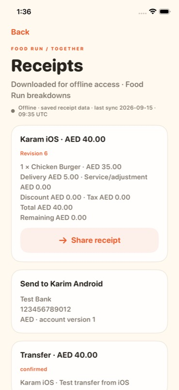
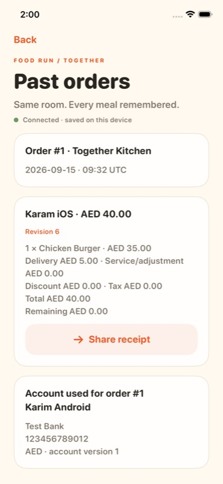

# Food Run — app guide

Food Run helps a group choose who collects the food, agree on an order, and track who owes the payer. It runs on Android and iOS with a matching cream and orange theme.

[Watch the 60-second app and architecture demo](media/food-run-demo.mp4) · [Architecture](ARCHITECTURE.md) · [Hub setup](../room-server/README.md)

## A quick look

<table>
<tr><th>Start here · iOS</th><th>The wheel · iOS</th><th>Shared room · Android</th></tr>
<tr><td></td><td></td><td></td></tr>
<tr><th>Restaurant library · iOS</th><th>Offline receipt · iOS</th><th>Past orders · iOS</th></tr>
<tr><td></td><td></td><td></td></tr>
</table>

Screens are actual emulator/simulator captures. Together Kitchen, the restaurant contact, Test Bank account and payments are demonstration data. The video combines a real wheel recording with screen captures and a rendered architecture diagram; it is not a continuous recording of the entire order/payment test.

## 1. Pick someone without a room

Open **Quick Spin**. The default crew is Karim, Karam, Hassan, Mersal, Baraa, Fayed, Ayman, Rayan, Gaber and Fakhr.

- **Who's in?** includes or excludes people for this spin.
- **Add person** adds another name; blank, duplicate and overly long names are rejected.
- Spin, see the selected person, and optionally share the result using the system share sheet.
- The crew and recent pickup history stay on this device. No hub is needed.

Each included person has an equal chance. Spins are independent; the same person can win twice.

## 2. Create a permanent table

Start the local hub on a Mac or PC using the [setup instructions](../room-server/README.md). Keep the computer awake and connect the phones to the same reachable local network.

The organizer opens **Create a room**, connects to the hub using its pairing information, chooses a restaurant, sets fees and creates the room. Friends use **Join a room** with the same hub and the six-digit room code. The organizer approves new members.

**Rooms and memberships do not expire automatically.** Return through the saved room on the home screen. Members can join or skip each meal without repeating room approval. Access depends on preserving the hub's database and keys and the phone's saved data; explicit removal or storage loss can require rejoining.

There is **one restaurant per order**. The next order in the same room can use a different restaurant.

## 3. Save the restaurant once

Use **Restaurant library** to create a restaurant or import a menu JSON file. Review the import before confirming it. Save its name, currency, contact and menu, then select it for an order. Delivery/service fees and discounts are confirmed for the order.

Saved restaurants can be edited, shared as JSON and imported on another phone. **Save restaurant** copies the current room's restaurant to that device's library. Sharing opens the native share sheet; it does not publish a menu automatically.

The JSON format supports categories, variants, options, availability and pricing rules. See the [example menu](restaurant-menu.example.json). The native editor provides a simpler item-entry flow; JSON is useful for richer menus.

## 4. Gather, get ready and spin together

Everyone ordering chooses daily participation and marks themselves ready. Members who can contact, order and pay for the group explicitly enable that eligibility. A spectator can watch without entering the payer selection or receiving private financial details.

The organizer starts the shared wheel when the required people are present, ready and connected. The hub waits for preparation acknowledgements, chooses one eligible member and publishes a common start time and result. Both apps animate that same round. Reconnecting during a round shows its current progress/result.

The selected person accepts the responsibility. A decline or recovery action follows the room rules and records a reason where required; the app does not silently assign an unwilling payer.

## 5. Choose food and confirm the receipt

The payer shares a receiving account, choosing a saved account or adding one. Members select food, options, quantities and notes, then submit their carts. The group reviews the final quote and recipient before the payer records placing the order with the restaurant.

**Example from the cross-platform test:** two AED 35 burgers plus AED 10 delivery equals AED 80. Each member's receipt is AED 40. Money uses integer minor units so fee allocation does not drift through floating-point rounding.

Every ordering member confirms the current quote, including someone choosing no food. Changes to the relevant order details require fresh confirmation. The payer sees the combined restaurant order and everyone's receipts; other ordering members see their own receipt and recipient.

## 6. Order, pay and settle

The payer uses the restaurant contact, orders manually and records the restaurant payment. Members transfer money outside Food Run and declare the amount/reference in the app. The recipient confirms or rejects each declaration.

Food Run **records payments; it does not move money**. A declared transfer is not counted as confirmed receipt. Partial payments, corrections and refunds follow the bill and approval rules. The room cannot move to the next order while balances or unconfirmed transfers remain.

After fulfillment and settlement, the organizer archives the meal and starts **Next order**. The room code, approved members and historical receipts remain.

## 7. Take the receipt with you

Open receipts while connected to download them. Saved receipts and their original recipient remain readable offline and can be shared as a text document. The screen identifies offline data and its last synchronization time.

Live room, spin and payment updates require the local hub. Returning to the local network resumes synchronization. This version does not provide internet access to rooms after leaving Wi-Fi.

## Common situations

| Situation | What to do |
| --- | --- |
| A friend is absent | Skip this order; the organizer must explicitly resolve absent expected invitations before spinning. |
| Everyone wants food but nobody can pay | At least one ordering member must consent to being selected. |
| The restaurant or quote needs a correction | Use the permitted menu/reopen/fee controls before placement; review the new quote. |
| The app says the room changed | Read the latest state before retrying; another device may have updated it. |
| A request timed out | Use the saved retry action; the same command ID prevents duplicate application on the hub. |
| The computer changes address | Re-pair using the same hub certificate and its current address. |
| The hub is asleep or Wi-Fi is gone | Downloaded receipts remain readable; live actions resume after reconnection. |
| Next order is unavailable | Finish fulfillment, confirm transfers and resolve every balance/refund first. |

## Verification

The documented 1.1 run passed **146 automated tests** and a complete Android ↔ iOS order/payment/recovery workflow. See the [test report](GROUP_ORDER_TEST_REPORT.md) for exact coverage and limits. Physical-phone camera scanning, Windows execution, real restaurant calls and real bank transfers were outside that test run.
