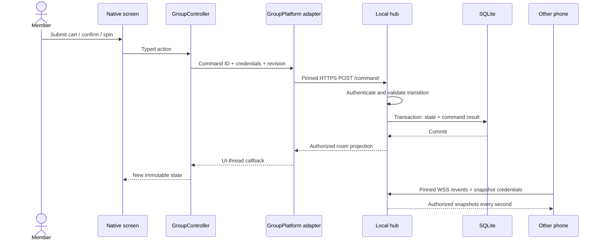
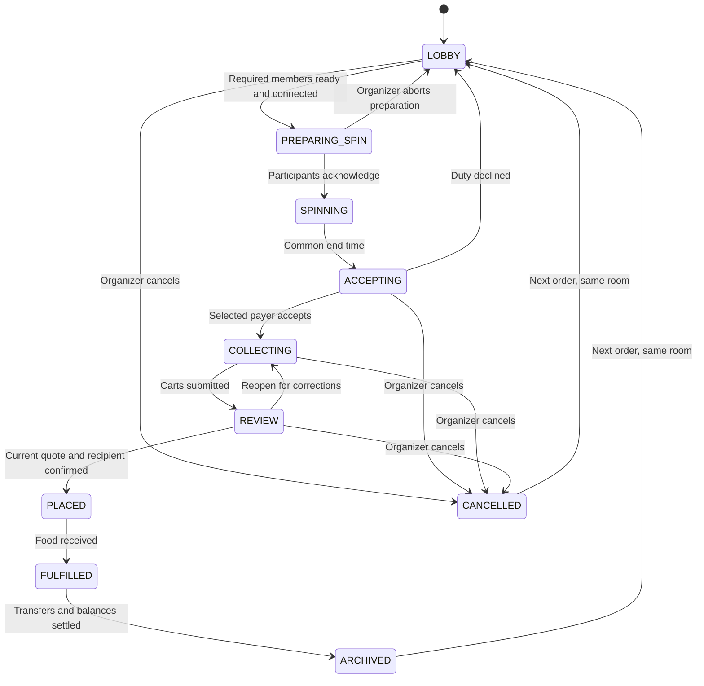

# Food Run architecture

Food Run has two native mobile interfaces over shared Kotlin application and domain code. A local JVM hub is the authority for group rooms. Quick Spin remains independent and works entirely on the device.

[PNG diagram](media/architecture.png) · [App and architecture video](media/food-run-demo.mp4) · [App guide](APP_GUIDE.md) · [Quick Spin contract](SHARED_ARCHITECTURE.md)

## Module ownership

| Module / directory | Responsibility | Important entry points |
| --- | --- | --- |
| `FoodRun/` | SwiftUI rendering, lifecycle, native animation, network, Keychain-backed storage, discovery, camera and sharing | `GroupStore`, `GroupIosPlatform`, `PinnedHubSession`, `HubWatch` |
| `Packages/IosComponents/` | Focused reusable SwiftUI components adapted from the supplied local library | [Component provenance](component-reuse.md) |
| `androidApp/` | Compose rendering and equivalent native services using Android platform APIs | `GroupViewModel`, `GroupAndroidPlatform`, `GroupTransport`, `GroupSecureStore` |
| `shared/` | UI state, navigation, drafts, validation orchestration, derived display models, local library/session cache and retry coordination | `GroupController`, `GroupState`, `GroupPlatform`, `FoodRunController` |
| `order-domain/` | Serializable menu/order models, money, billing, eligibility and business invariants | `MenuValidation`, `Billing`, `RoomRules`, `SpinRound` |
| `order-contract/` | Versioned request/reply, pairing and saved-session wire types | `RoomCommand`, `RoomReply`, `HubPairing`, `StoredSession` |
| `room-server/` | Ktor/Netty HTTPS and WebSocket routes, authentication, command execution, state transitions, persistence and discovery | `RoomService`, `RoomReducer`, `RoomDatabase`, `Main` |

Native screens render shared immutable state and send typed actions. `GroupPlatform` supplies platform capabilities through callbacks delivered on the UI thread. Native adapters own connection/lifecycle mechanics; the shared controller owns user-facing state and decision flow. Android and iOS retain native animation, accessibility and system presentation while consuming the same business rules.

The reusable component layer preserves the Food Run theme rather than importing the MOHRE application runtime. See [component reuse](component-reuse.md) and the [platform audits](android-audit.md).

## How a room action reaches another phone

The current WebSocket route sends periodic full projections at one-second intervals. It is not a durable event-stream broker. A 250 ms hub maintenance loop finishes elapsed spins. HTTPS/WSS credentials are carried in encrypted message bodies, not query URLs.

Commands carry a stable ID. The hub persists a digest and the successful reply in the same transaction as the state change. Retrying identical content returns the recorded result; reusing an ID with different content is rejected. Shared pending requests retain their original hub identity. Critical changes use the relevant room, cart, quote or bill revision to reject stale actions.

## Permanent room, successive orders

A `Room` keeps its ID, join code and membership across meals. Its `orderNumber` increases when the organizer starts the next order. The previous order snapshot is retained in the history table. Each meal has one restaurant, currency and active payer.

This diagram shows the principal path and cancellation points. The [reducer](../room-server/src/main/kotlin/com/karim/foodrun/server/RoomReducer.kt) is the source of truth for guards, reasons, late joining, payer handover, amendments and refunds. Cancellation is not a substitute for settling a placed order.

There is no room/membership expiry timer. Presence is temporary and only determines readiness/connectivity; it does not delete membership. Removing a member explicitly revokes access. Losing device storage or hub data/keys can require recovery or rejoining.

## Shared spin

1. The hub checks expected attendees, readiness, recent presence and at least one eligible payer. New ordering participants default to eligible; the separate consent switch is hidden. Guests, skipped members and participants who declined duty are excluded as applicable.
2. It creates a preparation ID. Ordering participants acknowledge that preparation.
3. The hub selects the winner using `SecureRandom`, persists the round and publishes candidate IDs, winner, start time, duration and turns.
4. Both native renderers use the same `SpinRound.rotation(now)` curve with a server clock offset. The group spin lasts 6.5 seconds; local Quick Spin uses its own 5.4-second plan.
5. Reconnecting clients render the persisted round at its current time. The selected person must accept before collection proceeds.

The organizer's phone is a client; locking or closing it does not destroy the room. Live operation still requires the computer running the hub to remain awake and reachable.

## Money, privacy and consent

- Money is stored in integer minor units. Billing allocates fees, discounts and rounding consistently using currency precision.
- Members confirm the current quote and receiving account before placement. Amendments invalidate affected confirmations.
- A payer can see all ordering receipts and the combined order. Other ordering members receive their own cart lines, transfers and receipt. Guests and unapproved members receive restricted projections.
- Transfer declarations require recipient confirmation; declarations alone do not settle a receipt. Refunds and bill adjustments retain their approval rules.
- The receiving account used for a historical order is retained with that history so exports do not silently use a later account.
- Food Run is a manual coordination ledger. It does not execute transfers or place restaurant orders through an external API.

## Storage and trust boundaries

| Location | Stored data | Protection / behavior |
| --- | --- | --- |
| iOS group storage | Local restaurant/account library, sessions, pending command, downloaded room/receipt snapshots | Atomic AES-GCM files; 256-bit key in device-only Keychain; excluded from routine backup |
| Android group storage | Same shared library/session schema | Atomic AES-GCM files in `noBackupFilesDir`; key in Android Keystore |
| Quick Spin preferences | Crew, participation, haptics and recent pickups | Platform preferences; independent of the group network feature |
| Hub SQLite | Room/order bodies and recorded command replies | Payloads encrypted with AES-GCM; metadata such as IDs, codes and phases remains queryable |
| Hub session table | Token hash, room ID, member ID | SHA-256 hashes; raw bearer tokens returned to the authorized joining client |
| Hub identity files | TLS certificate/private key, TLS password and storage key | Private files in the hub data directory; must be backed up together |

Pairing trusts the hub certificate's SHA-256 fingerprint, supplied through the setup QR/link or manual entry. Discovery (`_foodrun._tcp.local.`) helps find a hub; it does not replace fingerprint verification. Native transports pin HTTPS/WSS to the selected hub identity.

SQLite is not whole-database encryption: record bodies are encrypted and selected metadata is plaintext. The storage key lives beside the database under restricted file permissions, so a complete hub backup must be treated as sensitive. This is transport encryption to the trusted hub, not end-to-end encryption between phones.

## Offline and restart recovery

- Save snapshots while connected. Offline screens use downloaded data, clearly show connectivity and retain historical recipients.
- Live mutations need the hub. A timed-out pending command is retried with its original ID and hub; the hub prevents duplicate application.
- Resume saved sessions after app/hub restart. Updating a hub's address while preserving its certificate updates matching saved sessions.
- Preserve the hub database, encryption key and TLS identity together. [Backup and restore instructions](../room-server/README.md#data-backups-and-upgrades) cover a stopped-hub copy.
- Lost/corrupt storage is surfaced as an error; it must not silently become a fresh empty financial state.

## Scaling the implemented design

The module boundaries support independent native UI changes, shared rules and a replaceable transport/persistence boundary. The current deployment is deliberately one local hub process with SQLite and synchronized service operations. It has not been load-tested as a multi-tenant internet service.

Current safeguards include:

- 100 active rooms per hub; up to 30 approved nonguest members, 10 approved guests and 30 expected invitation names. Another join is rejected once 60 nonremoved membership records, including pending requests, exist.
- 2 MiB request/frame bounds, bounded room projections and replies below the native 4 MiB response budget.
- Five history entries per page, indexed active spin lookup, bounded native storage and unchanged-snapshot write throttling.
- Per-source request/connection admission limiting at the route, explicit protocol version checks and strict JSON validation.

For larger deployments, measure database latency, projection size, connection count and snapshot bandwidth first. A future implementation could move to per-room command serialization, revision-triggered broadcasts, a transactional server database and a real device/member recovery flow. Multiple server instances would also need shared authorization, durable command deduplication, coordinated timers and presence. These are extension points, not features currently shipped.

Off-network access, push notifications, cloud accounts, multiple restaurants within one order and automated bank payments are outside version 1.1.

## Verification and media sources

The [full flow audit](FULL_FLOW_AUDIT.md) records the latest 223-test matrix and a fresh Android ↔ iOS run through order, payment, adjustment, refund, offline recovery, and permanent-room reuse. Mutations carry `expectedOrderNumber`, independently of room/cart/quote revisions, to prevent a delayed command from affecting another meal in a permanent room. [UI flows](../Tests/UI/README.md) and platform audits explain reproducible integration setup. Passing this matrix does not establish every physical device/router condition.

Diagram source: [GenerateShowcase.swift](../Scripts/GenerateShowcase.swift). Video assembly: [build-showcase.py](../Scripts/build-showcase.py). [Media index and transcript](media/README.md) describe the captures and video chapters.
