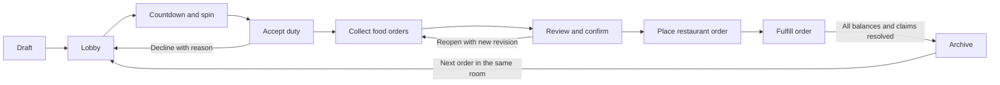

# Food Run: local-network group orders

Status: implementation decisions reconciled with the app and local hub on 15 September 2026. The user confirmed a Mac/PC hub, local-only live updates, offline downloaded receipts, permanent rooms and membership, and emulator/simulator testing for this release. See [hub setup and backup guide](../room-server/README.md), [server audit evidence](../room-server/AUDIT.md), and [delivery validation progress](GROUP_ORDER_PROGRESS.md).

## 1. Product outcome

Anyone in the group can create an order or join an existing order. The creator chooses a restaurant and invites the expected people. Everyone watches the same spin. The selected person accepts responsibility for placing and paying for the restaurant order. Members choose their meals, approve their totals, and reimburse that person. The payer sees a consolidated restaurant order and each person's receipt and payment status.

Keep the existing Quick Spin experience, orange/cream theme, native SwiftUI/Compose screens and shared Kotlin rules. Home provides **Quick Spin**, **Create a room**, **Join a room**, and **Restaurant library**. The payer's receiving-account screen contains saved accounts.

### Implemented release boundaries

- A permanent room contains successive daily orders. Each order has one restaurant/branch, one payer and one currency; AED is preselected. The next order can select another restaurant or currency without creating another room.
- Native Android and iOS clients, an installed local hub, and no required user accounts.
- Confirmed network scope: live room/order/payment updates require access to the local hub; downloaded receipts remain available offline.
- Capacity: 30 approved ordering members plus 10 approved view-only guests. Server tests cover this capacity and reject excess approval. Members can skip an individual meal without losing membership.
- The selected person places the order manually by phone or messaging and pays externally. Food Run records and reconciles reimbursements.
- Default: reimburse the payer after the actual restaurant bill is confirmed. A future room policy can require advance contributions.
- Restaurant library stays on its owner's device; rooms receive a versioned copy. Members can explicitly save that shared restaurant to their own library.
- Saved payment accounts stay on the account owner's device; only an explicitly selected receiving account is shared with authorized room members.

## 2. Roles and permissions

Do not use “watcher” for everyone: watching the spin and placing a meal order are different capabilities.

| Role | Responsibilities and access |
| --- | --- |
| Creator / organizer | Configure restaurant, fees, invited roster and deadlines; approve joins; start the spin; manage room; nominate a successor. Does not become the reimbursement recipient automatically. |
| Ordering member | Choose own items, confirm own total, see own receipt and recipient details, declare transfers, view shared room progress. May also be eligible for the spin. |
| View-only guest | Watch room progress and spin; no cart, charge, candidacy or access to bank details and individual receipts. |
| Selected coordinator / payer | Accept duty, publish a receiving account, see all committed member orders/receipts, contact restaurant, confirm final bill, record fulfillment, confirm reimbursements/refunds. |
| Local hub | Enforce permissions, serialize room changes, store authoritative records, select winner and publish updates. It is separate from the creator's phone. |

Roles can overlap. A creator may also be an ordering member and the selected payer. Before selection, each ordering member opts into or out of duty; opt-outs are visible. At least one person must consent to duty. For delivery orders the responsibility is coordinating/paying; for pickup it includes collecting the food.

For privacy, the creator sees shared readiness and order progress by default. Detailed receipts/payment records become visible to the payer; any additional organizer access must be explicit. Restaurant exports contain no participant or payment information.

## 3. Full customer journey

1. **Create:** name the room; choose pickup/delivery, restaurant/branch, currency, fee policy and expected participants. Delivery requires a destination/contact. Per-person budget limits remain a future enhancement.
2. **Invite:** share the room code and hub pairing link through the native share sheet. The hub also displays its setup QR. Expected participants and member cards show participation, approval, readiness and connection status. Display names are invitation labels, not authenticated identities.
3. **Join once:** find the local hub automatically, scan QR, or enter its address and verified fingerprint. Enter a distinct display name and receive organizer approval. The saved member token resumes the same room on later days; there is no daily join requirement or expiry. A short code alone does not establish identity.
4. **Ready for spin:** participants acknowledge the restaurant, delivery/pickup mode and duty eligibility. The owner can remove an absent invitee with a visible reason. No timeout silently conscripts or removes someone.
5. **Watch:** the owner starts a countdown. The hub freezes the eligible roster, selects once, and sends the same animation plan to all clients.
6. **Accept duty:** the selected person accepts or declines with a reason. Acceptance is required before food collection opens. They select/add a receiving account and explicitly share it for this room. Declining creates a visible reroll record; it does not silently replace the original result.
7. **Choose food:** members browse the frozen menu, select sizes/add-ons/quantities, add preparation notes, and submit their own carts. Show a live estimate including their fee/discount share.
8. **Review and lock:** all ordering members confirm their final quote, or explicitly choose “No food this time.” The payer reviews the combined order and accepts the total they will advance. Price/fee changes invalidate affected confirmations.
9. **Place order:** payer opens a dialer or prepares a shareable restaurant message. Record restaurant acceptance/reference, actual prices, unavailable items, ETA and fees. Substitutions or increases require the affected member's approval before committing that change.
10. **Pay and fulfill:** the payer records restaurant payment and marks the food fulfilled when collected/delivered. Fulfillment and reimbursement remain separate; detailed preparing/ready sub-stages are a future enhancement.
11. **Settle:** each member sees “Send AED X to [payer]”, account details, a reference, and their itemized receipt. “I sent it” creates a claim; the payer separately confirms receipt of funds. Show remaining balance and adjustments.
12. **Complete and repeat:** archive only after fulfillment, restaurant payment, all reimbursements/refunds and pending transfer claims are resolved. The organizer starts **Next order** inside the same room. Approved memberships, room identity and paginated receipt history remain; members opt into or skip the new meal.

Browsing the menu while waiting is useful, but the requested baseline keeps the spin before cart submission. A later option can spin after carts are confirmed, when the amount to advance is known more accurately.

## 4. State transitions and edit rules



Fulfillment and settlement are separate state machines: food can arrive before everyone reimburses the payer. Every meaningful state transition is authorized and validated by the hub.

| Point in the flow | Policy |
| --- | --- |
| Before spin | Organizer may edit invited/eligible roster; affected readiness resets. |
| Countdown/spin | Roster and plan immutable. Late joins wait for result and require approval to order. |
| Collecting | Members edit only their carts. Saving a library restaurant does not mutate the room snapshot. |
| Final confirmation | Freeze menu, prices, fee rules, recipient version and cart revision; every confirmation references that quote revision. |
| Before restaurant placement | Organizer/payer may reopen with a visible reason; invalidate relevant confirmations. |
| After placement/payment | Menu/cart edits and ordinary cancellation are blocked. The payer proposes bill adjustments; members approve the revision, including when an adjustment returns to zero. Record resulting reimbursements/refunds before archiving. |
| Next day | Reuse the same room and credentials. Reset meal participation/readiness; never remove membership merely because someone skips a meal. |

Closing the app, reconnecting or replaying an animation never creates another spin or order. An empty room/order cannot progress. Repeated button taps are processed once.

## 5. Business gaps resolved

| Gap | Implemented rule / explicit extension |
| --- | --- |
| Someone joins under another person's name | Room-scoped member IDs and approval; never authenticate by display name or original integer crew ID. |
| Duplicate names/devices | Existing display names are rejected ignoring case/whitespace; resume the saved session or choose a distinct name. A replacement device requires organizer-mediated recovery/rejoining. |
| Expected person never arrives | Owner waits, removes them explicitly, or cancels. Show the updated expected list to everyone. |
| A member loses Wi-Fi | Keep their membership and acknowledged cart. Show disconnected status; do not erase their meal or silently change eligibility. |
| Winner cannot advance the money | Consent before selection, actual total approval before placement, and an explicit decline/handover path. No automatic charge. |
| Organizer and payer differ | Debts point to the actual payer, not the room creator. |
| Payer cannot continue | The selected winner can decline before accepting duty. After accepting, cancel and begin another order before restaurant placement if necessary. Organizer handover does not silently reassign the payer; post-payment payer migration remains outside this release. |
| Restaurant is closed/unavailable | Before placement, cancel this meal and use Next order in the same room to choose another restaurant. After placement, reconcile a restaurant-accepted refund through an approved bill adjustment and confirmed refunds. |
| Sold-out meal or price change | Before placement, reopen collection. Members explicitly remove invalid selections; the organizer/payer applies a saved menu update with a reason. Valid updates preserve remaining selections but reset submissions and quote confirmations. |
| Late join | During collection, the selected payer approves a pending orderer before the organizer admits them; an organizer flag cannot impersonate that consent. After placement, wait for the next order. |
| Member leaves after food was ordered | Leaving the screen does not cancel the accepted order or debt. Record any accepted restaurant cancellation and refund separately. |
| Participant without a phone | Proxy ordering and consented shared platters are future extensions. This release uses each participant's own membership/cart. |
| Cash / partial / excessive transfer | Record a transfer reference or cash note and confirm receipt. Partial transfers leave a balance; claims above the current balance are rejected. A later approved bill reduction can create a refund owed. |
| One person orders | One eligible candidate is necessarily the selected payer. Their own food contribution creates no self-transfer. A selected payer choosing no food can still pay for the rest of the group. |
| All participants order nothing | Cancel the food order; do not distribute delivery charges for an unplaced order. |
| Bill disputed | Keep the disputed amount visible and separate from confirmed settlement; do not label the room fully settled. |

## 6. Billing and reimbursements

### Calculation policy

- Store money as integer minor units plus currency; never use floating-point amounts. Resolve currency precision centrally.
- A cart line stores quantity, selected variant/options and notes. The hub derives prices from the room's authoritative menu snapshot; clients cannot submit trusted totals. Menu changes create a fresh quote revision before placement.
- Default delivery split: equal among members with committed food orders. Offer proportional-to-food-total as a room policy chosen before confirmation. View-only guests are excluded.
- The order-level discount is allocated proportionally to food value. During collection it is capped to food entered so far so the first small cart is not blocked; final review rejects a discount larger than the completed food total. Item-specific discount eligibility is a future extension.
- Tax treatment comes from the entered restaurant pricing/bill: included, added or explicitly unspecified. Do not infer a legal tax rate from currency/location. Missing pricing treatment must be resolved before final confirmation.
- Delivery and service fees are explicit. There is no default tip. Bank transfer fees remain outside the food bill; a group-agreed additional charge can be entered explicitly as a service fee.
- Allocate rounding remainders deterministically using fractional remainders, with stable member IDs as tie-breakers. Receipt shares must sum exactly to the final bill.
- A cart/roster change can change fee shares for everyone; recalculate and invalidate all changed confirmations.

Example: Karim orders AED 45, Karam AED 30, Hassan AED 25. Delivery is AED 10 split equally; AED 5 discount is allocated proportionally to food value.

| Person | Food | Delivery | Discount | Final share |
| --- | ---: | ---: | ---: | ---: |
| Karim | 45.00 | 3.34 | -2.25 | 46.09 |
| Karam | 30.00 | 3.33 | -1.50 | 31.83 |
| Hassan | 25.00 | 3.33 | -1.25 | 27.08 |
| Total | 100.00 | 10.00 | -5.00 | 105.00 |

If Karim pays the restaurant AED 105, he is owed AED 58.91 by the others. His own AED 46.09 is shown as his contribution, never as a transfer to himself.

### Receipt and ledger

Distinguish **estimated total**, **confirmed order total**, **actual bill**, and **remaining reimbursement**. An app-generated breakdown is a Food Run order receipt; a restaurant invoice is separate. Invoice photo attachments/OCR remain future extensions.

Each receipt includes room/order reference, person, restaurant, item/option details, currency, fee/discount/tax allocation, revision, payer and payment reference. A revised bill produces revised receipts and explicit deltas. A member who already paid may owe a top-up or be owed a refund.

Transfers have `declared → confirmed` or `declared → rejected` states, amount, timestamp and a required transfer/cash reference. The payer confirms incoming funds; the app does not infer bank settlement from a screenshot or a member's button tap. Refunds likewise need explicit confirmation. Retain transfer records and audited bill revisions; derive balances only from confirmed payments/refunds. Unresolved balances block archival, even when a reason is supplied.

## 7. Restaurant library and JSON exchange

Persist restaurants, branches, contacts, menu categories/items/variants/options, availability and default fees in encrypted device documents. A room uses its own restaurant/menu snapshot. Editing the library leaves active rooms unchanged until an authorized matching-restaurant update is explicitly applied; updates reset relevant revisions and confirmations, and are blocked after placement.

Create/edit manually, import from the native document picker, export through the native share sheet, and save a shared room restaurant locally. Use the same versioned format on both platforms; see [restaurant example](restaurant-menu.example.json).

For items with variants, exactly one variant is selected and its `priceMinor` replaces `basePriceMinor`. Selected option deltas are added per unit before multiplying by quantity. In v1 an option is selected at most once per unit; option-group minimum/maximum counts are enforced. Menu availability is manually maintained information, not a reservation of restaurant stock.

Import flow: **Choose file → Validate → Preview restaurant/items/prices → Import as new or update an identified local copy → Confirm**.

Validation requirements:

- Supported `schema`/`schemaVersion`, currency and integer non-negative prices; enforce IDs, references and option selection bounds.
- Enforced v1 bounds: 2 MiB input, 500 items, bounded text lengths and nesting. Active-room projections have a stricter combined sync budget, so a large menu/cart can be rejected with an actionable size error.
- Reject duplicate IDs, invalid option references and structurally invalid files without changing the library. Show field-specific errors.
- Validate usable contact fields before placing an order; do not execute URLs or load remote content during import.
- No embedded binary images in v1. Optional image support is a later feature with separate download limits.
- Identify exports with export ID/revision and restaurant ID. Never replace a local restaurant solely because names match. Newer unknown schema versions are rejected clearly; duplicate IDs and JSON keys are rejected.
- Canonical exports contain restaurant/menu/default pricing information only. Exclude account details, room tokens, participant identities, orders, receipts and payment records.

## 8. Saved receiving accounts

The implemented receiving account contains an ID, holder name, bank, currency and IBAN/account identifier. Additional country/routing/BIC fields are future extensions. Validate structure and checksum where supported, while clearly avoiding a claim of bank ownership verification.

The selected payer chooses a saved account or adds one, previews the details and chooses **Share for this order**. Members see only that chosen account, their amount and reference. Copy buttons reduce typing errors. Mask account data on summary screens; reveal full transfer details deliberately.

Use the shared platform storage interface with encrypted native documents: iOS AES-GCM with a device-only Keychain key and atomic protected files; Android AES-GCM with a Keystore key and AtomicFile in no-backup storage. Do not store bank credentials, PINs, OTPs or card security codes. The room hub sees the explicitly shared account information; this is not end-to-end encrypted against its administrator. Protect stored hub data and back up the complete encrypted database/key/certificate set. Permanent membership and order history have no automatic deletion timer. [Apple Keychain](https://developer.apple.com/documentation/security/keychain-services), [Android Keystore](https://developer.android.com/privacy-and-security/keystore).

Account edits are versioned. Changes after publication create a visible notice and require acknowledgement before new transfer instructions are shown. Historic confirmed transfers keep the original recipient version. Deleting a saved account does not rewrite a completed receipt.

## 9. Networking decision and platform constraints

### Confirmed hosting: an independent local hub

Run a small Kotlin/JVM server on a Mac/PC on the same reachable network. A creator's phone is a client with organizer permissions, so switching to the dialer/banking app does not terminate the room. The hub needs to remain awake and its firewall must permit the configured local port.

An iPhone is not a reliable always-running room server: iOS suspends ordinary apps in the background and provides no general-purpose indefinite server execution. This also limits live watching on a backgrounded client; on return it must resynchronize. This recommendation follows [Apple's background execution guidance](https://developer.apple.com/forums/thread/685525).

| Deployment | Benefit | Constraint |
| --- | --- | --- |
| Local computer hub | Works without internet; both phones behave equally; reliable while phones switch apps | Requires an awake computer; same reachable network; no live off-network access |
| Creator phone hosts | No separate computer | iOS background suspension, battery and disconnect risk; not the recommended production baseline |
| Hosted internet server | Off-network updates and easier sharing | Hosting, connectivity, identity and operational scope expand |

The confirmed local-only scope means the pickup person loses live updates after leaving Wi-Fi. Before departure, cache the complete locked restaurant order, contact, destination and available receipts on the payer's phone; cache each member's receipt and recipient details. Downloaded receipts remain readable offline after an app restart, with their revision and last-synced time visible so cached balances are not presented as current confirmations. Offline edits remain visibly pending and require server validation on return. Reconnect automatically resynchronizes with the local hub. Do not promise live updates or push notifications over an unreachable LAN. A future online mode can use the same command protocol with a different server endpoint, but is outside this release and requires a separate deployment and identity project.

### Finding and trusting the hub

- Bonjour on iOS and DNS-SD/NSD on Android for a fixed service type, with QR/address fallback. Discovery finds endpoints; it does not authorize access. [Android NSD](https://developer.android.com/develop/connectivity/wifi/use-nsd).
- iOS must explain local-network access and declare its Bonjour services. Denial/revocation needs a retry/settings flow. Avoid unnecessary custom UDP broadcast and broad multicast entitlements. [Apple local-network privacy](https://developer.apple.com/documentation/technotes/tn3179-understanding-local-network-privacy).
- Current Food Run targets Android API 36 and will need `INTERNET`. Android 17/API 37 targeting introduces local-network permission requirements or a system-mediated NSD picker path; handle this explicitly when upgrading the target. [Android local-network permission](https://developer.android.com/privacy-and-security/local-network-permission).
- Guest Wi-Fi/client isolation, blocked multicast, VPN routing and changing IPs can break reachability. QR/manual address fixes discovery failures, not a network that blocks client-to-hub traffic.
- Use TLS/WSS with a paired hub certificate/key fingerprint obtained through its setup QR or explicit fingerprint confirmation. Verify this on both native engines in phase 0. Never accept every certificate or disable transport security globally.
- Room codes and approved member credentials persist with the room. Rate-limit join attempts and require organizer approval; authority comes from the authenticated membership and server-side owner/payer roles. QR invitations never contain member/owner tokens or bank details.

## 10. Technical architecture and data ownership

Retain native UI and existing components. Do not grow the current `FoodRunController` into one controller for every feature.

```text
androidApp (Compose)                iOS app (SwiftUI)
                 \                /
                  :shared client
           feature state + use cases
        network / database / secure ports
                         |
                 :order-contract
          versioned commands and events
                         |
                  :room-server (JVM)
            permissions + transactions
                         |
                  :order-domain
       order, spin, pricing, ledger rules
```

Implemented Gradle boundaries: keep `:shared` as the mobile facade, introduce `:order-domain` (pure common Kotlin), `:order-contract` (serializable transport types), and `:room-server` (JVM). Feature packages inside shared cover lobby, restaurants, menu/cart, live spin, receipts and settlement. Keep Android components in their current package as already accepted.

- Reuse and extract the current `SpinPlan` mathematics; keep Quick Spin local. Networked spins use a separate authoritative server lifecycle.
- Transport: Ktor/JVM hub, native Android OkHttp and iOS URLSession adapters behind the shared platform interface. HTTPS carries commands; WebSockets carry authorized room snapshots. Both native adapters verify the explicitly paired certificate fingerprint. [Server WebSockets](https://ktor.io/docs/server-websockets.html).
- Mobile persistence: encrypted native document storage for restaurants, accounts, saved sessions, cached rooms/receipts and pending commands. This replaces the proposed Room KMP dependency. Atomic writes preserve complete snapshots; device-only keys and no-backup files exclude this data from routine cloud restore. Existing Quick Spin persistence remains separate.
- Hub persistence: transactional SQLite with migrations, encrypted room/receipt/replay bodies, durable command deduplication and archived orders. Full snapshots restore authoritative state after a missed WebSocket update; a separate event/outbox replay protocol was not needed for this release. An indexed phase column avoids repeatedly reading all rooms for spin maintenance; presence heartbeats stay in memory. A multi-server deployment requires a separate concurrency/database design.
- Session controllers expose immutable observable state/StateFlow. Networking and disk work run off the main thread; shared results enter UI state through one controlled execution context. Own/cancel collectors with the screen/session lifecycle and preserve Swift observation cleanup.

### Core models

| Model | Key contents |
| --- | --- |
| Profile / membership | Persistent UUID and credential, display name, approval/guest role, daily participation, eligibility/readiness, late payer consent and presence |
| Room | Persistent UUID/code/owner and membership, current order number, configuration, phase/revisions, expected roster, currency and fulfillment mode |
| Restaurant / menu snapshot | ID, branch/contact, categories/items/options, tax treatment and server-authoritative prices; library exports have a schema/version |
| SpinRound | ID, frozen eligible IDs and order, algorithm version, schedule, landing plan, result, reroll reason |
| Cart / committed order | Member ID, lines/options/notes, revision, quote confirmation, price snapshots |
| Bill / receipt | Quoted and actual costs, fee/discount/tax allocation, revisions, restaurant invoice reference |
| Shared receiving account | Minimal room-specific account snapshot, owner, version, publication consent |
| Transfer / adjustment | Stable ID, debtor/creditor, amount/currency, declared/confirmed state, actor, reason and recipient version |
| Command / snapshot / audit | Command ID, resource revision, actor/action/time, authorized current snapshot and durable replay response |

Use UUIDs for new network identities. Existing local `Person.id` remains a local roster concern and must not become a network authentication identifier.

## 11. Synchronization, fairness and recovery

Commands carry `commandId`, room/member identity, protocol version, payload and the revision of the resource being edited. The hub authenticates the actor, validates permissions/rules, applies the change transactionally and acknowledges its revision. Retried commands use the same ID and return the original result. Editing one's cart uses a cart revision, so another person's unrelated edit does not unnecessarily conflict.

WebSockets publish authorized full room snapshots approximately once per second, carrying room/quote/cart revisions and server time. Reconnecting authenticates with the saved membership credential and receives the current snapshot; stale replies do not replace newer state. Retrying a pending command uses its original ID. Keep unsent or pending work distinct from server-accepted orders; financial commands and final confirmations are not optimistically marked complete. Receipt history uses bounded pages with explicit next offsets, avoiding silent age-based truncation.

### One synchronized spin

1. Freeze the eligible member IDs, ordering and roster revision after the readiness gate. Send a prepare event and wait for acknowledgement from all required ordering members. Optional view-only guests do not block the room. A missing required acknowledgement returns the organizer to a visible wait/resolve state before a result is chosen.
2. In one server transaction create the round ID, choose uniformly with a secure random source, and persist its `SpinPlan` and start/end times.
3. Broadcast a scheduled start roughly three seconds ahead. After this commit, a lost acknowledgement or network interruption never selects a new winner; that client catches up when reachable. No protocol can guarantee simultaneous rendering on a disconnected phone.
4. Clients estimate server clock offset using ping round trips and animate from local monotonic time. Send a plan once, not frame-by-frame wheel images.
5. The hub finalizes the stored winner when the scheduled end is reached, even if every phone disconnects. Completion is never controlled by a client animation callback.
6. A reconnecting client catches up to the current progress or displays the recorded winner. Reduced-motion clients reveal that same result at the same logical end.

Proposed target: start/reveal within 250 ms across healthy foreground clients on a normal LAN; measure real devices before accepting this target. Identical outcomes and no duplicate spin are hard requirements. Audit all rerolls; the UI cannot choose a winner. The trusted hub administrator can still control its software/database; do not market this as cryptographically verifiable fairness. Commit/reveal is an optional future enhancement.

### Failure policies

- Creator disconnects: hub and room survive. Existing authorized actions continue; creator-only actions await reconnection or explicit pre-authorized successor handover. Do not elect a random connected person as owner.
- Hub restarts: reload the committed room/scheduled round, finalize an elapsed spin once, and send the current snapshot. Never redraw because the process restarted. Permanent saved memberships resume with their existing credentials.
- Hub unavailable: show read-only cached room/receipt and local drafts; block authoritative progression. Exported order sheets remain available for manual continuity.
- Native app backgrounds: do not assume its socket or countdown keeps executing; resync on foreground.
- Lost member credential/device reinstall: owner-mediated rejoin, revocation of the old session, and preserved order identity.
- Conflicting commands: reject with current revision and a readable resolution; never silently overwrite a cart or receipt.
- Supported protocol versions are explicit. An incompatible client gets an update-required state before joining.

## 12. Security, visibility and retention

Treat the local network as reachable by other people, not inherently trusted. Enforce authorization on the server for every command and snapshot projection. A member cannot edit another cart, start a spin, inspect all receipts or confirm their own incoming reimbursement.

Separate public progress from member-private receipts and payer-only details using server-filtered projections. Pending applicants receive a restricted view; guests and people skipping the current meal receive no current financial details. Redact credentials/account identifiers from logs. Bound requests/replies, throttle joins, and revoke removed memberships explicitly. Room codes and memberships do not expire automatically.

Final retention decision: **no room expiry, membership TTL, daily rejoin, or 30-day purge**. Orders and receipt history remain on the hub; history is paginated, not deleted. Saved restaurants/accounts and downloaded receipts remain on the device until explicitly removed or app data is lost. Phone group documents are encrypted and excluded from routine cloud backup. Stop the hub and back up its entire stable data directory, including SQLite companion files, storage.key, hub.p12 and tls.password together; see the [backup guide](../room-server/README.md). Deleting a source cannot revoke exported copies already shared.

## 13. Implementation sequence and acceptance gates

| Phase | Deliverable | Gate |
| --- | --- | --- |
| 0. Connectivity proof | Local hub startup/pairing; iOS+Android discovery, TLS, permission denial, background/reconnect | Per user direction, iOS Simulator and Android emulator connect to the same hub; phone backgrounding does not stop it. Physical-device testing is outside the current validation pass. |
| 1. Domain foundation | Order models, roles, revisions, database migrations, integer billing and JSON format | Deterministic billing tests, migration tests and import/export round trips pass |
| 2. Rooms and live spin | Create/join, invited roster, readiness, presence, authoritative round, duty acceptance | At least three mixed-platform clients show one result; restart/disconnect/repeated-start cases pass |
| 3. Restaurant and ordering | Local library, import/share, menu/options, personal carts, final confirmations, consolidated order | Stale prices and concurrent changes handled; only authorized cart changes accepted |
| 4. Receipts and settlement | Receiving accounts, actual bill, individual receipts, payment claims/confirmation, partials/refunds | All shares balance exactly; own contribution excluded from reimbursement; private data visibility verified |
| 5. Hardening and delivery | Offline caches, lifecycle tests, accessibility, deployment/backup guide, Android/iOS/hub packaging | Full meal rehearsal using emulator/simulator; server restart and saved-session recovery; record actual results in the delivery validation progress. |

All phases 0–5 form the local-network release. The server/domain/contract audit records 66 passing tests covering the complete order workflow and recovery rules. Native builds, automated UI checks and emulator-to-simulator communication evidence are tracked separately in [delivery validation progress](GROUP_ORDER_PROGRESS.md); a server test is not evidence of a physical-device test.

### Required tests

- Retain the existing 45 shared/iOS tests and Quick Spin behavior.
- Money: indivisible fees, discounts exceeding eligible food value, tax modes, payer own share, zero orders, partial/excess transfers, revisions and refunds.
- Permissions: forged member IDs, own-versus-other carts, organizer-versus-payer actions, private event projections and revoked tokens.
- Rooms: permanent saved membership, daily participation, expected missing members, duplicates, actual late payer consent, consent changes, last eligible person and organizer succession.
- Concurrency: double start/submit, dropped acknowledgement/retry, stale quote, simultaneous cart edits, reconnect gaps, process crash between DB commit and broadcast.
- Spin: same frozen order/plan across Android/iOS, clock skew, reduced motion, late resume and hub restart after scheduled end.
- Imports: malformed/oversized JSON, unknown schema, duplicate IDs, invalid option ranges, decimal prices and export privacy.
- Native flows: network/camera permission denial, manual join fallback, app background while paying, dynamic text, TalkBack/VoiceOver, dark-system/light-app rendering and small screens.
- Operational rehearsal: a complete multi-phone order, unavailable item amendment, payer confirmation, meal delivery and reconciliation after one phone leaves Wi-Fi.
- Offline receipts: download, disconnect, restart the app and open saved receipts; verify revision/last-synced status, then reconnect and reconcile updated bills and payment states without duplicate records.

## 14. Useful enhancements after the baseline

1. Repeat previous cart selections with current prices reviewed inside the same permanent room; Next order already preserves the room and can reuse its restaurant.
2. An optional balanced-duty mode that avoids consecutive winners; label it clearly because probabilities differ from equal-chance mode.
3. Richer restaurant-ready exports and invoice attachments; the current app already shares combined order text with modifiers, preparation notes and attribution.
4. Per-person budget caps and explicit “approve increases up to…” limits.
5. Shared platters split by consented shares, then multiple payers/multiple restaurants as separately designed extensions.
6. Receipt-photo assistance/OCR with manual confirmation, not automatic final pricing or payment verification.
7. Optional internet-backed rooms and notifications for off-network updates; lightweight browser joining would be a separate client with the same protocol.

## 15. Final decisions

- **Confirmed:** a local Mac/PC on the same Wi-Fi will run the Food Run server. Android and iOS phones connect as clients.
- **Confirmed:** local-only live order and payment updates for now; downloaded receipts remain available offline. Internet-backed live updates are outside this release.

- **Confirmed by the user:** rooms and memberships persist; join once and resume on subsequent days. No daily expiry or automatic deletion timer. Use emulator and simulator for current testing.
- **Implemented business defaults:** spin before cart submission, explicit duty consent, equal delivery split with a proportional option, proportional order discount, manual reimbursements after restaurant payment, one payer/restaurant/currency per meal, organizer approval and actual payer consent for late orderers.
- **Final settlement rule:** archive and Next order require the previous placed meal to be fulfilled and all balances/pending transfers resolved. Cancellation before placement also permits Next order without replacing the room.
- **Final storage choice:** encrypted atomic native documents for mobile data; encrypted transactional SQLite records on the hub. Preserve the stable hub data path and back up database, encryption key and certificate together.
- **Deliberate later extensions:** internet mode, proxy/shared-plate ordering, multi-payer settlement, automatic bank verification, invoice images/OCR, finer delivery tracking and budget caps.
