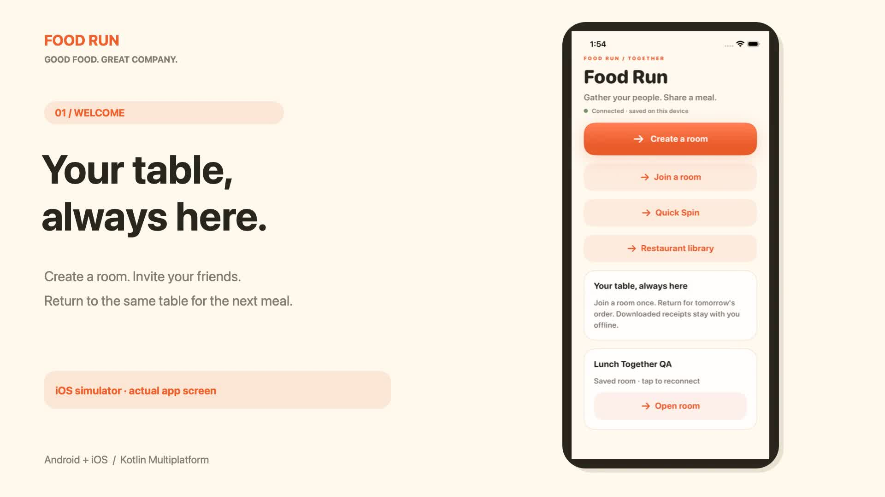

# Screenshots, video and architecture

All files in this directory are tracked alongside the app source.

## Current UI/UX screenshot gallery

These native captures show the refreshed interface implemented on 15 September 2026. See the [UI/UX review](../UIUX_REVIEW.md) for the design changes, tests, and walkthrough coverage.

| Capture | Context |
| --- | --- |
| [iOS home](ios-home.jpg) | Group meal actions, Quick Spin and restaurant shortcuts |
| [Android home](android-home.png) | Matching native Compose home screen |
| [iOS wheel](ios-wheel.jpg) | Responsive wheel, visible crew controls and pinned spin button |
| [iOS winner](ios-winner.jpg) | Fakhr selected, with pickup confirmation and sharing controls |
| [iOS connection](ios-connection.jpg) | Expanded manual hub pairing fields |
| [iOS library](ios-library.jpg) | Empty library with a pinned Add restaurant action |
| [Android room](android-room.png) | Friday lunch club, order progress, ready member and pinned spin action |
| [Android room · enlarged text](android-room-large-text.png) | Room layout at font scale 1.4 |

The iOS refresh was captured on iPhone 17 / iPhone 17 Pro simulators with iOS 26.0.1; Android captures use the local emulator. Friday lunch club, Alex QA, and The Lunch Spot are demonstration room/member/restaurant data. Captures are original screenshots, not recreated UI mockups.

## Earlier app and architecture video

The following video and its poster show the interface before the UI/UX refresh. They remain as a record of the earlier group-ordering release.

[](food-run-demo.mp4)

**[Watch / download the 60-second MP4](food-run-demo.mp4)** · [App guide](../APP_GUIDE.md) · [Architecture guide](../ARCHITECTURE.md)

GitHub's file page provides the MP4 preview/download. If an embedded preview is unavailable, download the file and open it in a video player.

## Video chapters and transcript

The video is silent, with explanatory text in the frame. It combines actual native app captures and a rendered architecture overview. It is a product walkthrough; the complete cross-platform test evidence is in the [verification report](../GROUP_ORDER_TEST_REPORT.md).

| Time | Chapter | What it shows / explains |
| --- | --- | --- |
| 00:00–00:06 | Welcome | Create or join a room and return to your saved table for the next meal. |
| 00:06–00:18 | Quick Spin | Real iOS wheel animation and Fayed's winner reveal. Ten default friends have equal chances; add more people through Who's in. |
| 00:18–00:27 | Together | Android's permanent room at order two. Approve people, get ready and spin together; one restaurant per order. |
| 00:27–00:35 | Restaurants | Save a local restaurant library; create, edit, import and share menu JSON. |
| 00:35–00:44 | Receipts | Confirm the total and recipient, track transfer confirmation, and retain downloaded receipts offline. |
| 00:44–01:00 | Architecture | SwiftUI and Compose use shared Kotlin state/domain/protocol modules. Native adapters connect to a local JVM hub with encrypted SQLite record bodies. |

## Earlier group-ordering verification captures

| Capture | Context |
| --- | --- |
| [iOS room](ios-room.jpg) | Member view of order two in the earlier verification room |
| [iOS offline receipt](ios-offline-receipt.jpg) | Settled AED40 receipt, recipient and confirmed test transfer |
| [iOS history](ios-history.jpg) | Previous order retained after starting order two |
| [Architecture SVG](architecture.svg) / [PNG](architecture.png) | System diagram, available as editable vector and raster |

These earlier captures were made on 15 September 2026 using the Android emulator and iPhone 16e / iOS 26.0.1 simulator. They show the previous interface and remain as evidence for the [group-ordering test report](../GROUP_ORDER_TEST_REPORT.md). Names such as Karim Android and Karam iOS identify test participants. Together Kitchen, its contact, Test Bank account and payments are fictitious. These screenshots contain no real bank transaction.

## Reproduce the media

On macOS, with Swift and FFmpeg available, run from the repository root:

```sh
python3 Scripts/build-showcase.py
```

The script generates the architecture SVG/PNG, five title cards, the MP4 and its poster. It uses the current committed screenshots plus the earlier [12-second native wheel recording](ios-spin.mp4). Record a new wheel clip and update chapter copy before producing a video that represents only the refreshed interface. Intermediate frames/clips stay in ignored `.build/showcase/`. The final video is H.264, 1920×1080, 30 fps, with fast-start metadata and no audio track.

The diagram is generated by [GenerateShowcase.swift](../../Scripts/GenerateShowcase.swift), which writes SVG and PNG from the same layout primitives. Screenshots are real native captures, not recreated UI mockups. The older [Quick Spin preview](../../Preview/food-run-demo.mp4) is also retained in the repository.
