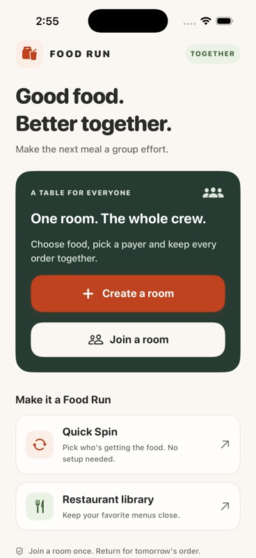
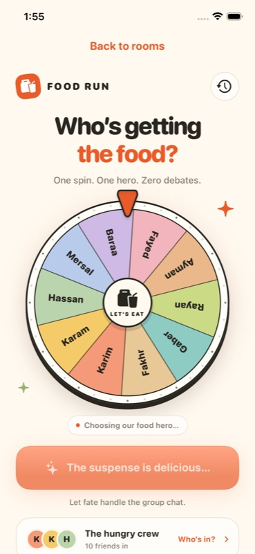
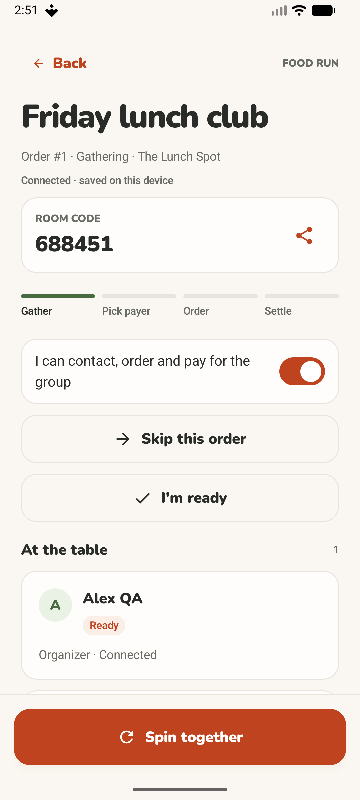
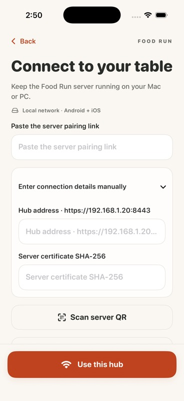
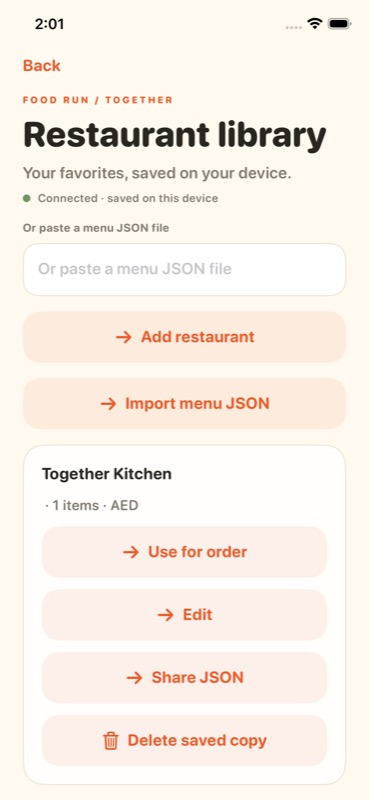
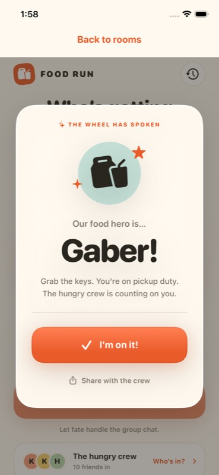
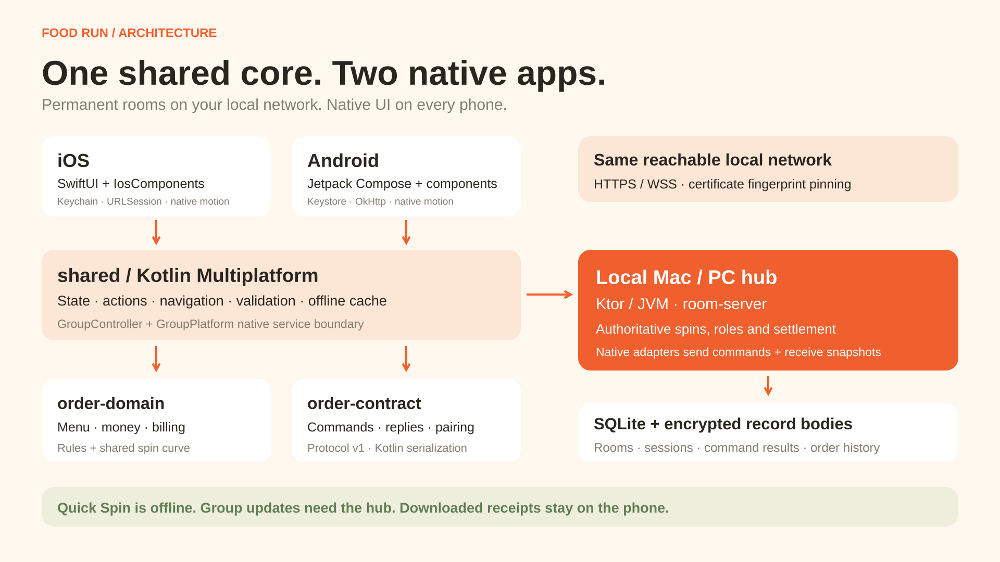

# Food Run 🍟

A Kotlin Multiplatform app for choosing who picks up food and organizing group meals, with native SwiftUI on iOS and Jetpack Compose on Android.

**Crew:** Karim, Karam, Hassan, Mersal, Baraa, Fayed, Ayman, Rayan, Gaber and Fakhr. Add more people in **Who’s in? → Add person**.

## See the app

The refreshed interface makes group meals easier to follow: a clearer home screen, room progress, expandable management controls, and primary actions that stay within reach.

<table>
<tr><th>iOS · home</th><th>iOS · Quick Spin</th><th>Android · shared room</th></tr>
<tr><td></td><td></td><td></td></tr>
<tr><th>iOS · connection</th><th>iOS · restaurant library</th><th>iOS · winner</th></tr>
<tr><td></td><td></td><td></td></tr>
</table>

**[UI/UX review and validation](Docs/UIUX_REVIEW.md)** · **[App guide](Docs/APP_GUIDE.md)** · **[Full screenshot gallery](Docs/media/README.md)** · **[Architecture](Docs/ARCHITECTURE.md)**

Screenshots are actual native simulator/emulator captures from the UI/UX refresh. The [earlier 60-second app and architecture demo](Docs/media/food-run-demo.mp4) documents the previous interface. All media is tracked in this repository and uses demonstration data.

## Install on Android

Build a signed APK using the [Android instructions](#build-android), then send the resulting APK to your friends. Open it on an Android phone, allow installation from that browser or file app when Android asks, and tap **Install**. Requires Android 8.0 or later. Generated installer files and private signing keys are excluded from Git; this repository contains the source and showcase media.

The APK is signed for installation and future updates. Quick Spin works offline. Group rooms use your own Mac/PC hub on the same local network; no cloud account is needed.

## Group meals on your local network

1. Build the hub distribution on a Mac or PC with Java 17 or newer. Follow the [hub setup guide](room-server/README.md#build-from-source) to build and start it with your computer's LAN address.
2. Keep the computer awake and connect phones to the same network. In Food Run, create or join a room and scan the hub's setup QR or paste its pairing link.
3. The organizer chooses a saved restaurant or creates/imports its menu, sets fees, and approves joining members. Participating members mark themselves ready before the shared wheel starts.
4. The selected person accepts, shares a receiving account, contacts the restaurant, and records ordering/payment. Each member chooses food, confirms the quoted total and recipient, and declares reimbursement; the recipient confirms receipt.
5. After fulfillment and settlement, start the next order in the same room.

**Rooms and memberships do not expire automatically.** Join once, then open the saved room for future meals. Use **Join this order / Skip this order** for daily participation. The organizer can remove members explicitly. Preserve the hub's data and keys and the app's saved data; uninstalling/resetting storage removes that device's saved membership.

Downloaded receipts and order history remain available offline. Live updates resume when the app reconnects to the hub. Payments are recorded manually; Food Run does not initiate bank transfers or contact restaurants automatically.

Restaurant menus can be saved locally, edited, shared as JSON, and imported with a preview. [Example menu](Docs/restaurant-menu.example.json). Saved receiving accounts and room sessions use encrypted native storage backed by Android Keystore or iOS Keychain.

## Convert a restaurant menu with AI

Give your AI agent a menu PDF, photos or text together with the [copy-paste prompt](Docs/AI_MENU_PROMPT.md), [JSON Schema](Docs/restaurant-menu.schema.json), and [complete example](Docs/restaurant-menu.example.json). It produces a `restaurant-menu.json` file with the restaurant, categories, prices, sizes and extras.

Review the extracted menu, then open **Restaurant library → Import menu JSON → Confirm import** in Food Run. The [menu import guide](Docs/RESTAURANT_MENU_IMPORT.md) explains the workflow, currency conversion, tax rules, missing information and updates to saved restaurants.

## Features

- A home screen that explains group meals and Quick Spin, with saved tables for returning groups.
- Room progress from gathering through settlement, with menus and personal orders before the member list.
- Persistent primary actions, expandable optional fields, and visible loading/error feedback.
- Improved contrast, scalable iOS text, and a wheel that adapts to screen height.
- Equal random chances for everyone included on the wheel.
- Smooth 5.4-second slowdown, moving pointer, optional haptic ticks, spring winner reveal and finite confetti.
- Include or sit out friends; at least one person stays in.
- Add names, validate blank/duplicate/long entries, and remove custom names.
- Save the crew, selection, haptic setting and last 30 pickups.
- Share the selected name through the native share sheet.
- Screen-reader labels and a brief reveal when reduced motion is enabled.
- Preserve preferences from the original iOS app when upgrading.

Each spin is independent, so a previous winner can win again. Kotlin chooses the winner first and calculates the exact landing angle; both platforms animate that same plan.

## Architecture



KMP owns form drafts, validation, navigation, application state and display models. Native adapters handle lifecycle, animation, secure storage, pinned transport, discovery and system sharing. The local JVM hub authorizes room changes, chooses shared spin results and persists group orders. Quick Spin operates separately using local preferences.

Reusable buttons, controlled inputs, avatars, cards and dividers preserve Food Run’s warm cream and orange palette, with deep green accents for group meals. The focused local [IosComponents package](Packages/IosComponents) is adapted from the supplied MOHRE library; Android has equivalent Compose components. Source provenance and fixes are in [component reuse](Docs/component-reuse.md).

The app uses English copy centralized in KMP. `shared` contains application state and presentation, `order-domain` contains menu/billing rules, and `order-contract` defines the wire protocol. The hub encrypts record bodies in SQLite. Read the [full architecture guide](Docs/ARCHITECTURE.md) for the module map, sequence/state diagrams, privacy, recovery and current scaling limits; see the [implementation plan](Docs/GROUP_ORDER_PLAN.md) for product decisions.

## Build Android

Prerequisites: JDK 17+, Android SDK platform 36, and SDK build tools. Set `ANDROID_HOME` or create an untracked `local.properties` with `sdk.dir=/path/to/Android/sdk`.

```sh
./gradlew :shared:jvmTest :androidApp:assembleDebug
```

Open this folder in Android Studio to run on a device or emulator.

For a signed release, this workspace already contains its release identity in the ignored `.signing/` directory. On a new project checkout, restore that directory to keep the same app signing identity. Only create a new identity for a new distribution:

```sh
python3 Scripts/create-android-signing.py
./gradlew :androidApp:assembleRelease :androidApp:lintRelease
```

The creation script preserves existing signing files. Back up `.signing/` privately; future updates need the same key. The generated APK is `androidApp/build/outputs/apk/release/androidApp-release.apk`.

## Build iOS

Prerequisites: macOS, Xcode, JDK 17+, and the Android SDK for Gradle project configuration. The first build downloads Kotlin dependencies.

1. Open `FoodRun.xcodeproj` in Xcode.
2. Select **FoodRun** and an iPhone simulator.
3. Run with **⌘R**; test with **⌘U**.

The Xcode pre-build phase builds and embeds the shared Kotlin framework automatically. Keep simulator ad-hoc signing enabled: Keychain storage requires the app's entitlements, so do not build with `CODE_SIGNING_ALLOWED=NO`. For a physical iPhone, select your Apple development team under **Signing & Capabilities** and run on the connected device. Requires iOS 17+.

After changing project structure, regenerate the project with `xcodegen generate`. To build both shared Apple framework variants explicitly:

```sh
./gradlew :shared:assembleFoodRunSharedDebugXCFramework
```

## Validation

The UI/UX refresh passed **79 automated tests**: **55 shared JVM tests** and **24 iOS tests**. Both native apps build successfully. Simulator/emulator walkthroughs cover navigation, Quick Spin, forms, room creation and readiness, including Android text at 140% size. The [UI/UX report](Docs/UIUX_REVIEW.md#verification) records the checks and their limits.

### Earlier release verification

Food Run 1.1 passed **146 automated tests with zero failures or skips**, plus the actual Android↔iOS order/payment flow, offline/server restart recovery and permanent-room reuse. The [test report](Docs/GROUP_ORDER_TEST_REPORT.md) records evidence, artifacts and simulator/emulator limits. The following original Quick Spin regression checks remain part of the expanded suites:

- **33 shared tests passed:** wheel landing, random eligibility, persistence, drafts, navigation, cancellation, save failures and timezone formatting.
- **12 iOS tests passed**, including the original preference/history migration.
- Android signed release build and lint passed; APK signature and 16 KB alignment verified.
- Installed and exercised the release on an Android emulator; built and launched the updated iOS app on iPhone 16e.
- [Audit and verification](Docs/AUDIT.md), [shared coverage](Docs/SHARED_COVERAGE.md), [Android audit](Docs/android-audit.md).
- Earlier Quick Spin captures: [Android](Preview/android-main.png), [winner](Preview/android-winner.png), [crew](Preview/android-crew.png). Current screenshots are in the [media gallery](Docs/media/README.md).

Pinned build versions are in the Gradle files. Nunito is bundled under its [Open Font License](Licenses/Nunito-OFL.txt).
